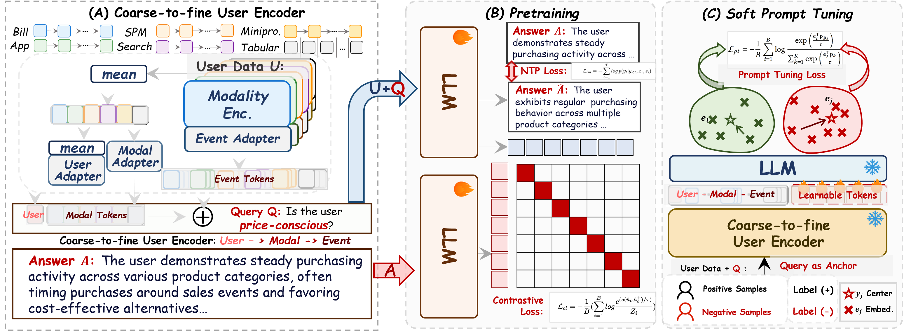

<h2>
<strong>Query-as-Anchor: Scenario-Adaptive User Representation via Large Language Model</strong>
</h2>

<h4>🔗 We introduce <strong>Query-as-Anchor</strong>: one model, many scenarios — dynamic user understanding through query-conditioned representation 🎯</h4>

<strong>📧 Contact:</strong><a href="mailto:jhyuan.cs@gmail.com">jhyuan.cs@gmail.com</a> ·<a href="mailto:baokun.wbk@antgroup.com">baokun.wbk@antgroup.com</a>

---

## 🔥 News
* `2026.02` 🎉 Our [*Query-as-Anchor*](https://arxiv.org/abs/2602.14492) paper has been released on arXiv — check it out now!  
  > 💻 **Code demo coming soon — stay tuned!**

---

## ⚖️ License
This project is licensed under the **Apache License Version 2.0**. See the [LICENSE](./LICENSE) file for details.
