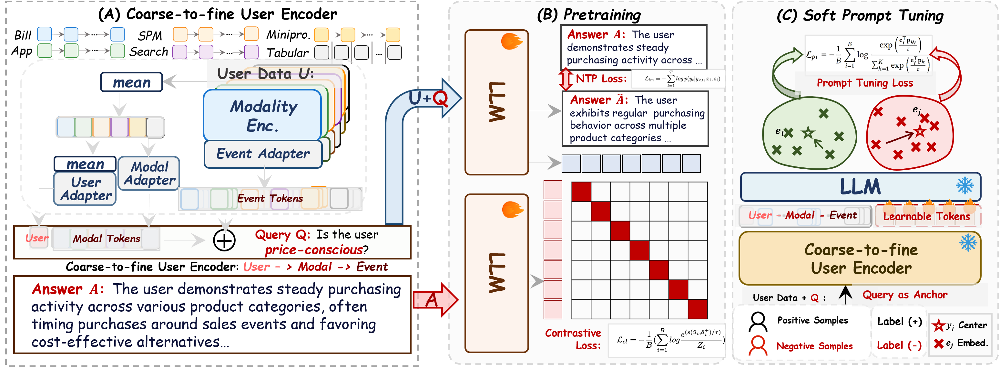

<div align="center">

<h2>
<strong>Query-as-Anchor: Scenario-Adaptive User Representation via Large Language Model</strong>
</h2>

<h4>🔗 We introduce <strong>Query-as-Anchor</strong>: one model, many scenarios — dynamic user understanding through query-conditioned representation 🎯</h4>

[](https://arxiv.org/abs/2602.14492)

[](https://huggingface.co/papers/2602.14492)
[](https://www.antgroup.com)

</div>

<p align="center"><strong>📧 Contact:</strong><a href="mailto:jamse_yuan@163.com">jamse_yuan@163.com</a>
  
<p align="center">

</p>

---

## 🔥 News
* `2026.05` 🎉 Our [*Query-as-Anchor*](https://arxiv.org/abs/2602.14492) paper has been accepted to KDD 2026 ADS Track! 

* `2026.02` 🎉 Our [*Query-as-Anchor*](https://arxiv.org/abs/2602.14492) paper has been released on arXiv — check it out now!  
  > 💻 **Public code demo available now !**

---
## 📚 Citation
If you find our work useful for your research, please kindly cite our paper as follows:
```python
@article{yuan2026query,
  title={Query as Anchor: Scenario-Adaptive User Representation via Large Language Model},
  author={Yuan, Jiahao and Xu, Yike and Wen, Jinyong and Wang, Baokun and Gao, Ziyi and Lin, Xiaotong and Liu, Yun and Fu, Xing and Cheng, Yu and Liu, Yongchao and others},
  journal={arXiv preprint arXiv:2602.14492},
  year={2026}
}

@article{yuan2026decoder,
  title={How Do Decoder-Only LLMs Perceive Users? Rethinking Attention Masking for User Representation Learning},
  author={Yuan, Jiahao and Xu, Yike and Wen, Jinyong and Wang, Baokun and Chen, Yang and Lin, Xiaotong and Huang, Wuliang and Gao, Ziyi and Fu, Xing and Cheng, Yu and others},
  journal={arXiv preprint arXiv:2602.10622},
  year={2026}
}
```
## ⚖️ License
This project is licensed under the **Apache License Version 2.0**. See the [LICENSE](./LICENSE) file for details.
